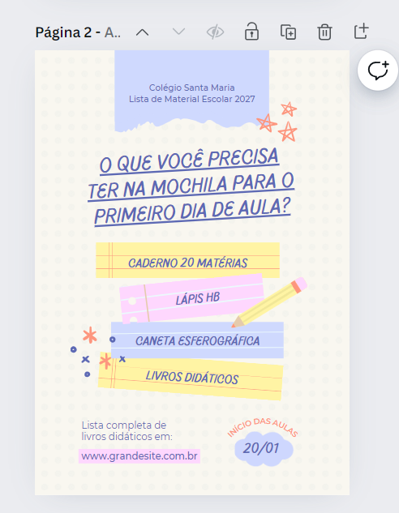
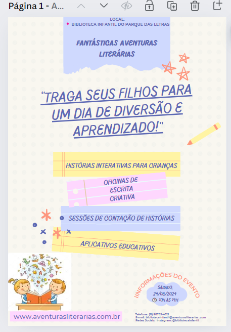
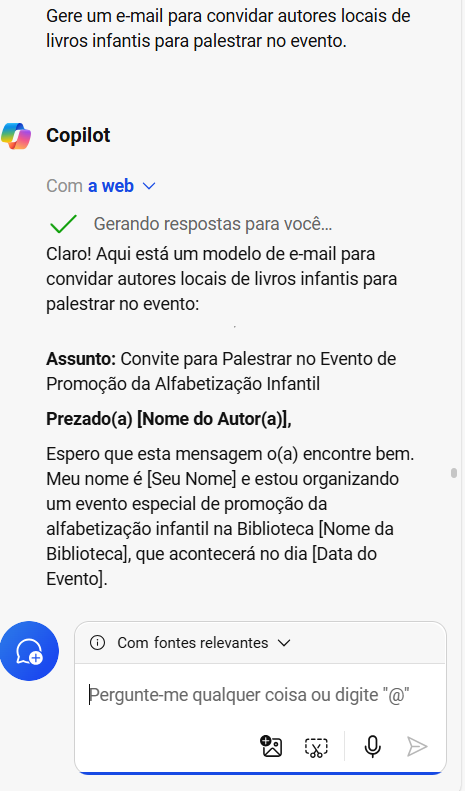
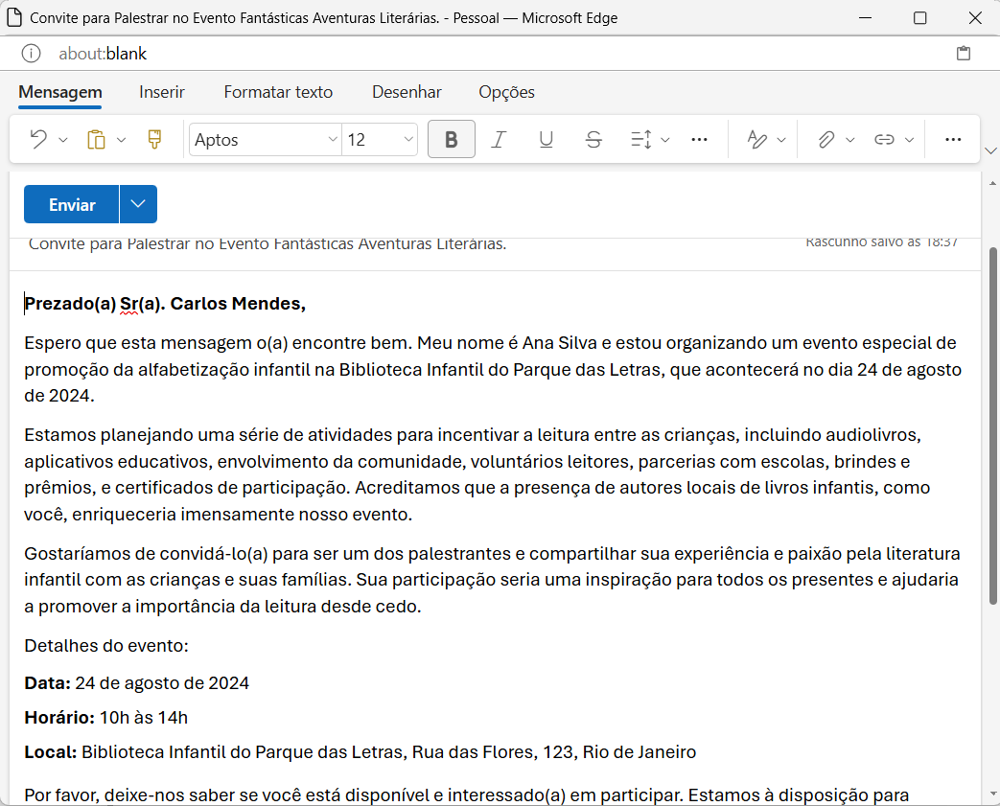
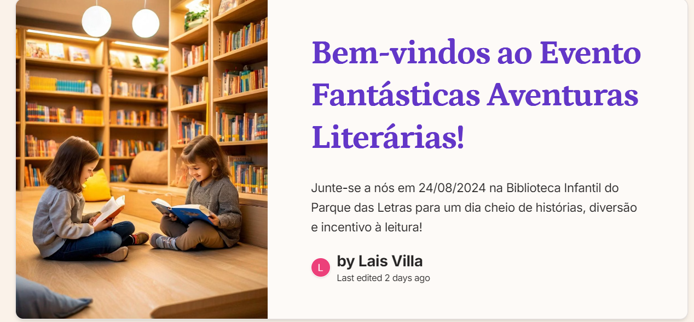
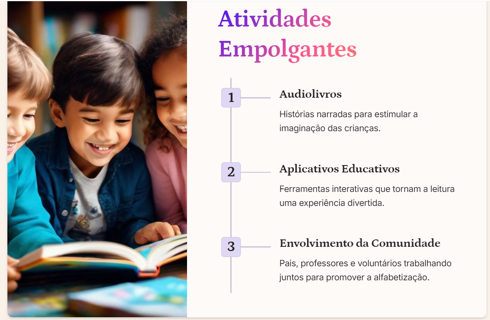

# **Evento de Promoção da Alfabetização Infantil**
## Tema: **Fantástica Aventura Literária**

Este projeto tem como objetivo planejar e organizar um evento de promoção da alfabetização infantil em uma biblioteca local, utilizando ferramentas de IA, como o Copilot, para criar materiais de divulgação e planejamento. O projeto inclui a criação de dicas de incentivo à leitura, um folheto de divulgação, um e-mail de convite para autores locais e uma apresentação para o evento.

---

## **1. Pesquisa de Dicas para Incentivar a Leitura**

Para começar, utilizei o Copilot para pesquisar e gerar uma lista de dicas práticas para incentivar a leitura entre as crianças. As dicas foram refinadas e adaptadas ao público-alvo do evento.

- **Captura da imagem da interface do Copilot**

  
  

---

## **2. Criação do Folheto de Divulgação**

O folheto foi criado utilizando o Canva, onde escolhi um modelo visual delicado e Lúdico. O texto adicionado foi gerado pelo Copilot na etapa de dicas para incentivar leitura, retirei algumas dessas dicas e montei o folheto, e as imagens algumas já tinha no folheto e uma de biblioteca gratuita de ícones e fotos. O layout foi ajustado para garantir clareza, impacto visual e gerar interesse principalmente para crianças.

- **Captura do modelo Antes** x **Depois**

    
    
  

---

## **3. Criação do E-mail de Convite para Autores**

Usei o Copilot para redigir um e-mail convidando autores locais de livros infantis para participarem do evento. O e-mail foi revisado e ajustado para garantir um tom adequado e convidativo.

- **Geração do E-mail** x **Texto Final do E-mail**
 

    
    

---
## **4. Criação da Apresentação para o Evento**

A apresentação foi criada no Gamma App, onde organizei e solicitei que fosse gerado uma apresentação com o conteúdo gerado pelo Copilot. A apresentação inclui uma introdução ao evento, atividades planejadas, informações sobre os palestrantes e agradecimento aos colaboradores.

[Apresentação Completa no Gamma App](https://gamma.app/docs/Bem-vindos-ao-Evento-Fantasticas-Aventuras-Literarias-ysymogqgwadyw7t?mode=doc)

- **Slide Introdutório** x  **Slide de Atividades** 

    
    

---

## **Conclusões e Aprendizados**

Este projeto permitiu explorar as capacidades do Copilot na criação de conteúdo diversificado. A integração de IA generativa facilitou a criação de materiais de alta qualidade, economizando tempo e proporcionando insights valiosos.

- **Resumo do Projeto**

    

