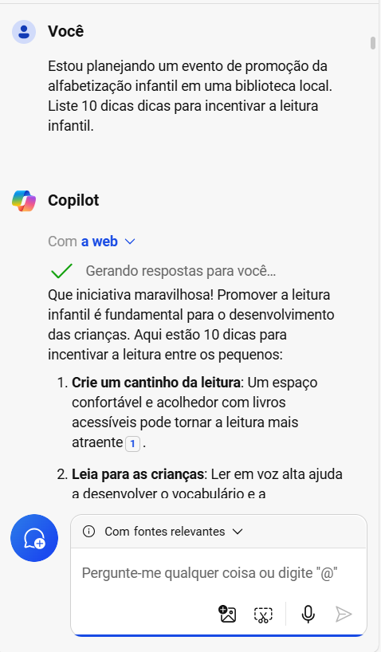
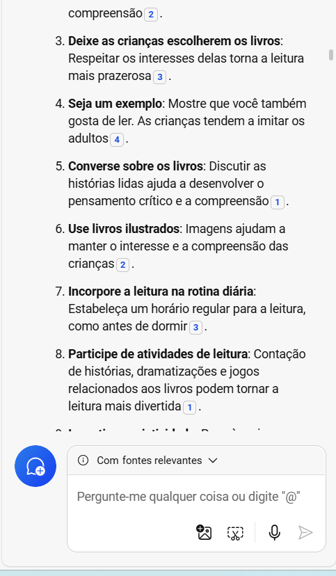

# **Evento de Promoção da Alfabetização Infantil**
## Tema: **Fantástica Aventura Literária**

## **Descrição do Projeto**
Este projeto tem como objetivo planejar e organizar um evento de promoção da alfabetização infantil em uma biblioteca local, utilizando ferramentas de IA, como o Copilot, para criar materiais de divulgação e planejamento. O projeto inclui a criação de dicas de incentivo à leitura, um folheto de divulgação, um e-mail de convite para autores locais e uma apresentação para o evento.

---

## **1. Pesquisa de Dicas para Incentivar a Leitura**

Para começar, utilizei o Copilot para pesquisar e gerar uma lista de dicas práticas para incentivar a leitura entre as crianças. As dicas foram refinadas e adaptadas ao público-alvo do evento.

## **Captura da imagem da interface do Copilot**

  
  

---

## **2. Criação do Folheto de Divulgação**

O folheto foi criado utilizando o Canva, onde escolhi um modelo visual delicado e Lúdico. O texto adicionado foi gerado pelo Copilot na etapa de dicas para incentivar leitura, retirei algumas dessas dicas e montei o folheto, e as imagens já algumas já tinha no folheto e uma biblioteca gratuita de ícones e fotos. O layout foi ajustado para garantir clareza e impacto visual.

## **Captura da imagem mostrando o modelo escolhido no Canva para personalizar.
